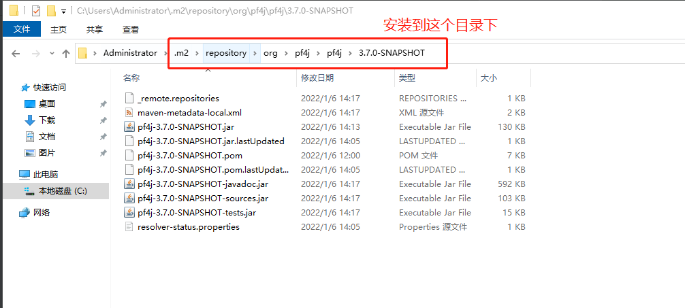

# SpringBoot-Pf4J
Integrate SpringBoot for Pf4J

https://github.com/pf4j/pf4j is a greate project

貌似只能更新一次，第二次更新会报错

另外，如果遇到pf4j-3.7.0-SNAPSHOT.jar找不到的错误，因为pf4j-3.7.0-SNAPSHOT.jar还没有在maven仓库发布，所以需要先安装在本地，它应该是这样的路径下，只需要拷贝文件即可

